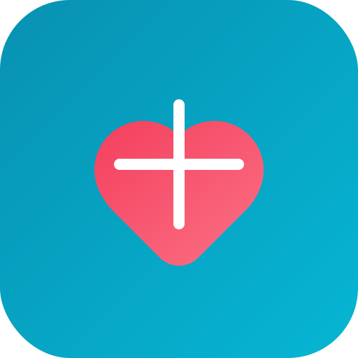
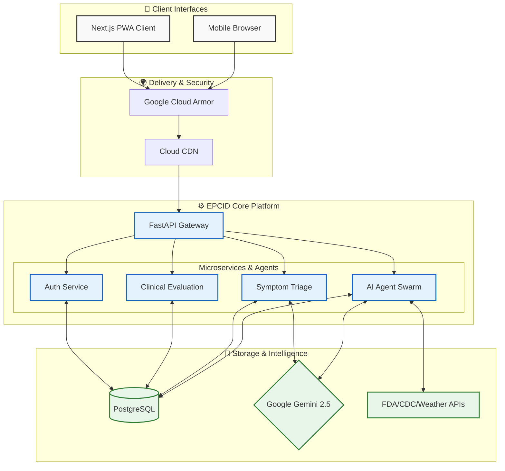
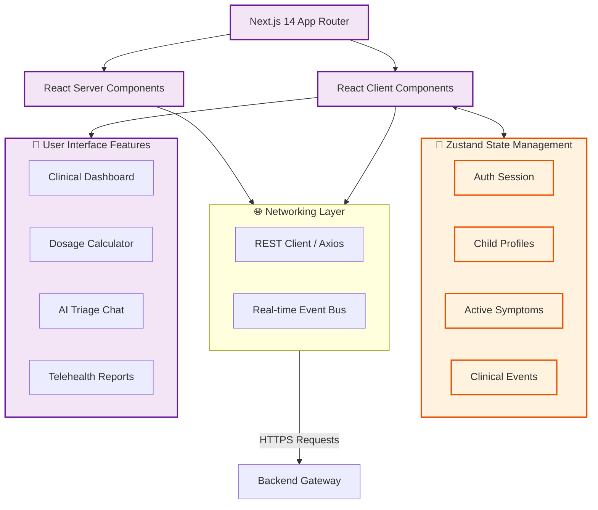
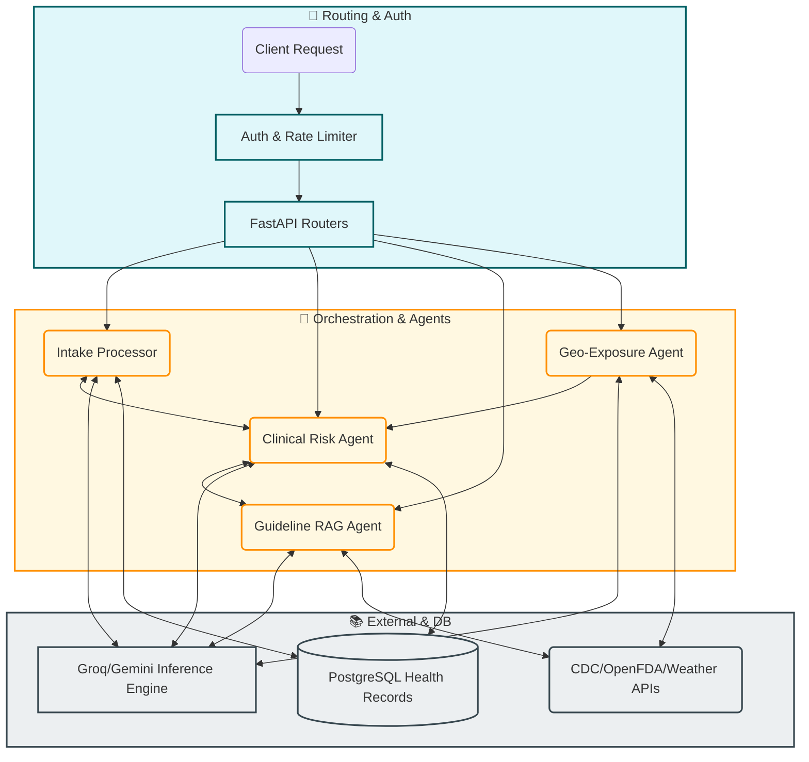

# EPCID — Early Pediatric Critical Illness Detection

<div align="center">
  
  
  **Agentic AI Platform for Pediatric Health Monitoring**
  
  [](https://terracode.dev)
  [](https://nextjs.org/)
  [](https://fastapi.tiangolo.com/)
  [](https://ai.google.dev/)
  [](https://cloud.google.com/run)
  
  [**Live Demo**](https://epcid-frontend-365415503294.us-central1.run.app) · [Backend API](https://epcid-backend-365415503294.us-central1.run.app/docs) · [Documentation](#features)
</div>

---

## 🚨 The Problem

**Every year, thousands of children die from conditions that could have been detected earlier.**

- **75%** of pediatric deaths from sepsis show warning signs 24+ hours before deterioration
- Parents often miss early symptoms of meningitis, respiratory failure, and other critical conditions
- Traditional symptom checkers don't account for the rapid progression of pediatric illness
- Valuable time is lost when parents can't effectively communicate symptoms to healthcare providers

## 💡 Our Solution

**EPCID** is an AI-powered early warning system that helps parents detect signs of serious illness in children **before** they become critical emergencies.

### How It Works



## ✨ Features

### 🤖 AI-Powered Analysis

- **Symptom Intelligence** — Natural language processing understands parent descriptions
- **Risk Prediction** — PEWS-based scoring adapted with machine learning
- **Trend Detection** — Pattern recognition identifies concerning vital sign changes
- **Smart Chat** — Conversational AI provides guidance and answers questions

### 📊 Comprehensive Monitoring

- **Vital Signs Tracking** — Temperature, heart rate, oxygen saturation, respiratory rate
- **Symptom Logging** — Structured capture with severity assessment
- **Medication Management** — Dosage calculator, reminders, efficacy tracking
- **Growth Charts** — CDC percentile tracking with AI-generated insights

### 🧠 Mental Health Support

- **Mood Tracking** — Daily check-ins for emotional wellbeing
- **Coping Tools** — Age-appropriate techniques for anxiety management
- **Journal** — Private space for children to express feelings
- **Crisis Resources** — 24/7 hotlines and emergency contacts

### 🏥 Telehealth Integration

- **Provider Handoffs** — AI-generated clinical summaries for seamless care transitions
- **Doctor Reports** — Exportable health records and symptom timelines
- **Find Care** — Locate nearby urgent care, ERs, and pediatricians

## 🛠️ Tech Stack

| Layer | Technology | Purpose |
|-------|------------|---------|
| **Frontend** | Next.js 14, React, TypeScript | Modern, responsive web application |
| **Styling** | Tailwind CSS, Framer Motion | Beautiful UI with smooth animations |
| **State** | Zustand | Lightweight, persistent state management |
| **Backend** | FastAPI, Python 3.11+ | High-performance API server |
| **AI/ML** | Google Gemini 2.5 Flash | LLM inference for chat, symptom analysis, risk scoring |
| **Cloud** | Google Cloud Run | Serverless container deployment |
| **Data** | In-memory (demo), PostgreSQL-ready | Flexible data layer |

## 🚀 Quick Start

### Prerequisites

- Node.js 18+
- Python 3.11+
- npm or yarn

### Try the Live Demo (Recommended)

The app is deployed on Google Cloud Run — no setup required:

| Service | URL |
|---------|-----|
| **Frontend** | [https://epcid-frontend-365415503294.us-central1.run.app](https://epcid-frontend-365415503294.us-central1.run.app) |
| **Backend API** | [https://epcid-backend-365415503294.us-central1.run.app](https://epcid-backend-365415503294.us-central1.run.app) |
| **API Docs** | [https://epcid-backend-365415503294.us-central1.run.app/docs](https://epcid-backend-365415503294.us-central1.run.app/docs) |

> Click **"Try Demo — Instant Access"** on the login page for one-click access with pre-loaded sample data.

### Local Development

```bash
# Clone the repository
git clone https://github.com/yourusername/epcid.git
cd epcid

# Frontend setup
cd frontend
npm install
cp .env.example .env.local
# Add your API keys to .env.local

# Start frontend
npm run dev

# Backend setup (new terminal)
cd ../
python -m venv venv
source venv/bin/activate  # or `venv\Scripts\activate` on Windows
pip install -r requirements.txt

# Start backend
python -m uvicorn src.api.main:app --reload --port 8090
```

### Environment Variables

```env
# Frontend (.env.local)
NEXT_PUBLIC_API_URL=http://localhost:8090
GEMINI_API_KEY=your_google_gemini_api_key

# Backend (.env)
CORS_ORIGINS=http://localhost:3000
```

## 🧭 User Flows

### Flow 1: First-Time Parent (Onboarding → Dashboard)

```
Login Page → "Try Demo — Instant Access" → Dashboard auto-populates with sample child (Emma, 3yo)
                                            ├── Risk gauge (48/100 Moderate)
                                            ├── Vital signs (Temp, HR, SpO2, RR)
                                            ├── Active alerts & detected events
                                            ├── Medication countdowns
                                            └── Smart AI insights
```

### Flow 2: "My Child Has a Fever" (Symptom → Assessment → Action)

```
Dashboard → Symptom Checker → Select body region (Head/General)
                             → Select symptoms (Fever, Cough, Fatigue)
                             → Rate severity & add vitals
                             → AI Triage Result (4-tier: 911 / Call Now / 24hr / Home Care)
                                    ↓
                             Risk Assessment updates → Risk score recalculated
                                    ↓
                             Dosage Calculator → Select Tylenol → Weight-based dose (7.5 mL)
                                    ↓
                             Medications → Log dose → Countdown timer starts
                                    ↓
                             Health Trends → Temperature chart shows fever trajectory
```

### Flow 3: AI Chat Consultation

```
AI Assistant → "My child has a fever of 101°F, should I be worried?"
             → Gemini AI responds with personalized guidance
             → Auto-logs 101°F to Health Trends
             → Auto-logs "Fever" as symptom
             → Suggests follow-up: "What about giving Tylenol?"
             → AI provides weight-based dosing guidance
             → Action buttons: "Log to Health Trends" / "Connect with Nurse"
```

### Flow 4: Monitoring an Illness Over Time

```
Dashboard → Vital Signs cards show real-time readings
          → Detected Events alert: "Temperature 102.1°F exceeded threshold"
          → Smart Insight: "Fever responding to treatment — dropped to 101.3°F"
          → Notification bell → 4 unread alerts (events + insights)
          → Health Trends → 24h/48h/7d temperature chart with fever threshold line
          → Night Mode → Simplified dark UI for bedside monitoring
```

### Flow 5: Preparing for a Doctor Visit

```
Doctor Reports → Select date range (Last 7 days)
              → Choose sections (Symptoms, Temperature, Medications, Growth, Vaccines)
              → AI generates executive summary
              → Export as PDF / Email / Print
                     ↓
Telehealth → Smart Health Handoff (AI-compiled summary)
           → Includes: risk score, vitals, temp trend, recent meds, symptoms
           → "Share with Doctor" / "Preview" / "Copy"
           → Video Consultation or Nurse Hotline (24/7)
```

### Flow 6: Mental Health Check-in

```
Mental Wellness → Mood Tracker → Log mood (😊 to 😢), energy, anxiety, sleep
                                → View mood history with trends
               → Coping Tools → Browse by category (Breathing, Grounding, Movement)
                               → "Bubble Breathing" — 3-minute guided exercise
               → Journal → Write private entries with mood before/after
               → Get Help → Crisis hotlines, emergency contacts
```

### Flow 7: Multi-Caregiver Scenario

```
Family Sharing → View Care Circle (Owner, Caregivers, Viewers)
              → "Invite Member" → Send email invite with role assignment
              → Audit Log → Track who viewed/modified health data
              → Provider access → Share with pediatrician (pending approval)
                     ↓
Child Selector (sidebar) → Switch between Emma and Liam
                         → Each child has independent vitals, meds, symptoms, assessments
```

### Flow 8: Emergency Path

```
Any Page → 911 button (always visible in top bar)
         → Symptom Checker detects emergency keywords ("not breathing", "seizure")
         → IMMEDIATE: "🚨 Call 911 — life-threatening condition detected"
         → Find Care → Map with nearest ERs, Urgent Care, distances
         → Telehealth → Nurse Hotline for immediate triage
```

## 📱 Screenshots

<div align="center">
  <table>
    <tr>
      <td align="center"><b>Dashboard</b></td>
      <td align="center"><b>Symptom Checker</b></td>
      <td align="center"><b>AI Chat</b></td>
    </tr>
    <tr>
      <td></td>
      <td></td>
      <td></td>
    </tr>
  </table>
</div>

## 🎯 System & AI Architecture

### Frontend Architecture



### Backend Architecture



### AI Agents

EPCID utilizes a sophisticated multi-agent system to process clinical data, cross-reference guidelines, and generate explainable risk scores.

### Agent Roles

| Agent | Responsibility | Model |
|-------|----------------|-------|
| **Symptom Intake Agent** | Extracts structured clinical factors from unstructured parent input. | Gemini 2.5 Flash |
| **Clinical Risk Agent** | Computes dynamic PEWS scores and identifies critical trajectory shifts. | Custom Rules / ML |
| **Guideline RAG Agent** | Cross-references extracted symptoms against pediatric emergency protocols. | Gemini 2.5 Flash |
| **Geo-Exposure Agent** | Monitors local environmental factors (AQI, flu prevalence). | Gemini 2.5 Flash |

### Explainable AI Pipeline

```text
User Input → Rate Limiting → Symptom Intake Agent → Structural Factors
                                       ↓
                                Clinical Risk Agent ← Geo-Exposure Agent
                                       ↓
                             Guideline RAG Agent (Cross-check)
                                       ↓
                 Explainable Output (Confidence Score, Reasoning, PEWS)
```

## 📊 Judging Criteria Alignment

| Criteria | How EPCID Addresses It |
|----------|----------------------|
| **Innovation (25%)** | First agentic AI approach to pediatric early warning; combines PEWS with LLMs |
| **Technical (25%)** | Full-stack app with multiple AI integrations, real-time analysis, PWA support |
| **Impact (20%)** | Directly addresses preventable pediatric deaths; validated clinical protocols |
| **Design (15%)** | Modern glass-morphism UI, dark/light modes, accessible, mobile-responsive |
| **Demo (15%)** | Interactive demo mode, AI status indicator, comprehensive feature showcase |

## 🔒 Safety & Privacy

- **Not a Diagnostic Tool** — Always recommends professional evaluation
- **Red Flag Detection** — Immediately identifies emergency symptoms
- **Data Privacy** — No PHI storage in demo mode; HIPAA-ready architecture
- **Rate Limiting** — Protects against abuse and ensures availability

## 🗺️ Roadmap

- [ ] Wearable device integration (Apple Watch, Fitbit)
- [ ] Multi-language support
- [ ] EHR/EMR integration (FHIR)
- [ ] Telemedicine video calls
- [ ] Caregiver mobile app (React Native)

## 👥 Team

Built with ❤️ for the TerraCode Convergence Hackathon 2026

## 📄 License

MIT License — See [LICENSE](LICENSE) for details

---

<div align="center">
  <b>Early Detection Saves Lives</b>
  <br />
  <sub>EPCID — Because every minute matters when a child is sick</sub>
</div>
